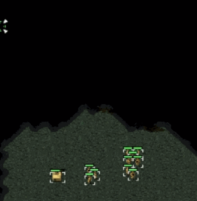

# Pathfinding


You've built a [maze solver](../../../maze-solver-challenge), now let's step up the difficulty. In this challenge you will use your knowledge of data structures and algorithms to build a **Pathfinding AI**. Your code will be similar to algorithms used in strategy games to control how units find their way across a map based on your instructions.

Unlike the maze solver, your pathfinder will be operating on _terrain_. It will have obstacles, but will otherwise be an open map.

We're going to be building algorithms that deal with terrain in different ways, so don't forget to make your _own_ maps and play around along the way. Watching your pathfinding AI move through a map is the best part of this challenge!

## The Terrain Format

The terrain is the same format from the Maze Solver challenge, just with fewer contraints:

```
............
.....#......
.....#...#..
..o..#..#*..
.....#......
.....######.
............
```

 * `#` is a block
 * `.` is an open tile
 * `o` is your start point
 * `*` is your goal

Note: Your existing code should be able to read the map without any changes.

## Release 0, Everything Old is New Again

Use your code from the [Maze Solver](../../../maze-solver-challenge) challenge to read in the two maps below and solve them.

```
............
.o..........
............
.....#......
............
.........*..
............
```

```
............
.....#......
.....#...#..
..o..#..#*..
.....#......
.....######.
............
```


**You shouldn't need to change a line of code**, your strategies from the Maze Solver challenge should still work.

Answer the following questions in `notes.md`:

 * Why do your strategies still work in an open map?
 * Are BFS and DFS searching efficiently? Why or why not?
 * How do your strategies differ visually on the more open map?
 * Theoretically, what would you _like_ to be able to do to make your search more efficient? Don't worry about "how" yet.


## Release 1, Finding Your Way

Read the first two sections of this [introduction](http://www.redblobgames.com/pathfinding/a-star/introduction.html) to the A\* algorithm (everything up to "Movement Costs") before you continue.

### Pathfinding

Like the author, modify your solver and strategies to return a _path_ instead of `true` or `false`. Tweak your algorithms slightly to keep track of how you explore the graph and return the path it finds.

Return a list of [x,y] coordinates representing the cells to follow from the origin to the goal. Raise an exception if the map is unsolvable.

### Bail Early
Make sure your algorithm exits as soon as it finds the goal, don't continue to explore after the goal is discovered.

### Visualize It
Adjust your visualizer to show the final path on the map at the conclusion of the solver run.

Do the paths from your two algorithms differ? If not, can you construct a map where the paths differ? Why do they differ? Commit your thoughts in `notes.md`

## Release 2, Taking Priority

DFS and BFS can determine a path between two points, but as you've seen, they don't always search very efficiently.

We're going to add a new search algorithm into the mix. This one will use a [PriorityQueue](http://en.wikipedia.org/wiki/Priority_queue) instead of a Stack or Queue to prioritize certain unexplored tiles over others.

### Release 2.1, Implement PriorityQueue

Write and test a basic `PriorityQueue` class. It should conform to the following minimal interface:

 * `PriorityQueue::new`: create a new instance of `PriorityQueue`
 * `PriorityQueue#add(element, priority)`: Add `element` to the priority queue with a priority value of `priority`. `priority` should be an integer.

  **Important:** If the `element` passed to `#add` is already in the queue, the priority value for that element should simply be updated. It should _not_ add a duplicate element into the queue. Make sure you write a test for this.
 * `PriorityQueue#pull`: Remove and return the element with the highest `priority` from the queue.
 * `PriorityQueue::empty?`: Return true if the queue is empty.


### Release 2.2, Heuristics

Some function will need to serve as a heuristic. Your heuristic will be responsible for determining a priority ranking for a given unexplored tile so it can be ordered in the PriorityQueue. Tiles with a high priority in the queue should be explored first.

Use the [Manhattan distance](http://en.wikipedia.org/wiki/Taxicab_geometry#Formal_definition) between X and the finish as your heuristic function for now. You can try different heuristics later.

### Release 2.3, "Best-First" Search

Now you have a PriorityQueue and a simple heuristic that uses the Manhattan distance between a tile and its goal to determine its priority in the search. Implement a strategy using these and run it against this map:

```
.................
........#........
........#.*......
........#........
........#........
........#........
........#........
........#........
........#........
.o......#........
........#........
.................
```

Add something to your program that prints out the number of tiles explored and the length of the path generated by your strategy. Run DFS and BFS against the same map.

When you finish, answer these questions in `notes.md`:

 * How do the the strategies stack up in terms of steps taken and length of path? What trade-offs did you witness?
 * How does the heuristic search differ visually from the others? Why?
 * Is the heuristic path better, worse, or the same as your other approaches?
 * Can you construct a map where your heuristic search does better than your other strategies? Can you construct a map where it does worse?

## Release 3, When Best-First gets Greedy

Chances are, the heuristic-based strategy is beating out plain old BFS and DFS in a lot of your tests, but it's not fool proof. Try the three strategies against the following map:

```
#######################
#.....................#
#................#....#
#...o............#....#
#................#....#
#................#....#
#................#....#
#................#....#
#................#....#
#................#....#
#................#....#
#................#....#
#................#....#
#................#....#
#................#....#
#................#....#
#................#....#
#................#....#
#................#....#
#................#....#
#................#....#
#................#....#
#................#....#
#.################....#
#................#....#
################.#....#
#................#....#
#.################....#
#.................*...#
#######################

```

Interesting results.

 * Note that the Manhattan distance is a pretty naive heuristic, it beelines for the goal but that's actually a bad search pattern on this map. What's worse, it finds a very long path, not the most efficient one.
 * BFS probably finds the best path, but it takes a lot of steps to do it.
 * Depending on how DFS is implemented, you might get lucky and get a small search and short path, but it's by no means guaranteed (tweak this map to make DFS perform poorly).


## Release 4, A\*
We're going to add one more strategy, an implementation of the [A\* pathfinding algorithm](http://www.redblobgames.com/pathfinding/a-star/introduction.html#astar).

As a pathfinding algorithm, A\* optimizes for both efficient search _and_ shortest path. It uses a heuristic, just like your best-first search, to guide the search pattern. It also takes into account the distance from the _start_ to make sure it's not finding an inefficient route like the best-first manhattan distance strategy did.

To implement A*, you need to update how you calculate your priority value. Your priority function is now of the form `f(x) = g(x) + h(x)` where:

 * `h` your distance heuristic estimating the distance between `x` and your goal
 * `g` is the distance between `x` and the start point based on the current paths you have discovered thus far. In other words, `g` is not an _estimation_ like your distance heuristic, it's the length of the path you actually have from start to the current tile `x`.

Also note that:

 * A\* may re-explore tiles, this is purposeful. If the exploration finds a new, _shorter_ path to a given tile it needs to update the distance cost and thus the priority of the tile in the search. This is different from implementations like DFS, where skipping explored nodes is actually required to prevent an infinite loop (why?).
 * A\* may be slower than best-first or even DFS sometimes, but it should guarantee a best path
 * Don't forget the [A* Intro](http://www.redblobgames.com/pathfinding/a-star/introduction.html#astar) as you implement your strategy
 * The A\* Intro article mentions `graph.cost` in the code examples. For our purposes, assume `graph.cost` is always 1.
  > Why? In a more advanced map with varying terrain difficulties this function would calculate the cost of moving from, say, "plains" to "mountains". Our map is flat, so the cost to move between tiles is constant. In truth, we're ignoring one of A*'s powerful advantages, it can take variable distance costs (like hills, water, plains) into account.

 * Your A\* strategy may be similar in parts, but the approach is different enough that you should write it as a standalone strategy first before attempting to DRY it up in any way.

Again, refer to the above [A* Intro](http://www.redblobgames.com/pathfinding/a-star/introduction.html#astar) for more detail on the algorithm itself.


When you're finished, run your A\* strategy against the same map above. It _should_ perform much better than the other strategies. Your results might look something like this:

```
Final Route:
#######################
#...xxxxxxxxxxxx███...#
#..xxxxxxxxxxxxx█#█...#
#.xx█████████████#█...#
#.xxxxxxxxxxxxxxx#█...#
#.xxxxxxxxxxxxxxx#█...#
#.xxxxxxxxxxxxxxx#█...#
#.xxxxxxxxxxxxxxx#█...#
#.xxxxxxxxxxxxxxx#█...#
#.xxxxxxxxxxxxxxx#█...#
#.xxxxxxxxxxxxxxx#█...#
#.xxxxxxxxxxxxxxx#█...#
#.xxxxxxxxxxxxxxx#█...#
#.xxxxxxxxxxxxxxx#█...#
#.xxxxxxxxxxxxxxx#█...#
#.xxxxxxxxxxxxxxx#█...#
#.xxxxxxxxxxxxxxx#█...#
#.xxxxxxxxxxxxxxx#█...#
#.xxxxxxxxxxxxxxx#█...#
#.xxxxxxxxxxxxxxx#█...#
#.xxxxxxxxxxxxxxx#█...#
#.xxxxxxxxxxxxxxx#█...#
#.xxxxxxxxxxxxxxx#█...#
#.################█...#
#................#█...#
################.#█...#
#................#█...#
#.################█...#
#.................█...#
#######################
Steps: 356
Path length: 44
```

## Release 5, Have Some Fun

Build several different maps with different layouts. See how the various strategies you've produced fair against each other. Does A\* always outperform? Are there times where it falls down on the job?

## Stretch: Beam Me Up Scotty

Let's add a new tile type to your map, `@`. `@` represents a teleporter. There can only be two teleporters per map. As soon as you land on one `@` you are instantly transported to the other.

This is handy for transportation, but bad news for your strategies. For example:

 * This is a valid, solvable map.

   ```
   ......#......
   .@.o..#..*.@.
   ......#......
   ```
 * The shortest path on this map isn't a straight line from start to end.

   ```
   ..............
   .@.o......*.@.
   ..............
   ```

Update your A\* implementation to handle teleportation correctly.
